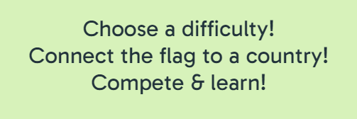

# The Flag Quiz
The Flag Quiz is a place for fun, learning and competition. Test your knowledge of flags from all around the world.

Find the deployed site [here](https://mikael-johnsson.github.io/the-flag-quiz/)

## CONTENTS

* [User Experience](#user-experience-ux)
  * [User Stories](#user-stories)
    * [Client Goals](#client-goals)
    * [First Time Visitor Goals](#first-time-visitor-goals)
    * [Returning Visitor Goals](#returning-visitor-goals)

* [Design](#design)
  * [Colour Scheme](#colour-scheme)
  * [Typography](#typography)
  * [Imagery](#imagery)
  * [Wireframes](#wireframes)

* [Features](#features)
  * [General Features on Each Page](#general-features-on-each-page)
    * [Header](#header)
    * [Landing Page](#landing-page)
    * [Game Page](#game-page)
    * [Result Page](#result-page)
  * [Future Implementations](#future-implementations)

* [Technologies Used](#technologies-used)
  * [Languages Used](#languages-used)
  * [Frameworks, Libraries & Programs Used](#frameworks-libraries--programs-used)

* [Deployment & Local Development](#deployment--local-development)
  * [Deployment](#deployment)
  * [Local Development](#local-development)
    * [How to Fork](#how-to-fork)
    * [How to Clone](#how-to-clone)

* [Testing](#testing)

* [Credits](#credits)
  * [Code Used](#code-used)
  * [Media](#media)
  * [Acknowledgments](#acknowledgments)

---

## User Experience (UX)

### User Stories
#### Client Goals
- Get the users to fully understand the site on the first look
- To not have any faulty questions
- Give the user an easy possibility to play the game again 
- Have the site responsive and working on different devices
#### First Time Visitor Goals
- Fully understand the site on the first look
- Believing the questions being on a level matching the chosen difficulty
- To have fun and learn
#### Returning Visitor Goals
- Getting new questions recurringly
- Feeling the need to get a better score
- To have fun and learn

## Design

### Colour Scheme

The colour scheme's most important task is to not stand in the way of the many different flag colours the user will come upon. The background is therefore "tea green" - a light neutral colour you do not see in any flag.

The rest of the palette are suggestions from the colour palette site [coolors.co](https://coolors.co)

Pink is used for header. Dark blue is used for text and button shadows. Red is used for *error message* and *wrong answer message*.

### Typography

Fonts are imported from Google Fonts. The font used in first hand is *Gabarito*. It is a sans-serif font well suited for the web. Even though the lines appear sharp, it has a subtle smoothness to it which goes well with the soft colours.

The font is used all over the site. In some places the text is bold, but for most of the site the regular font is used.

*The h1-heading*

*One of the paragraphs*

### Imagery

The only images found on the site are the flags. They are all in scalable png-files, to make them easier to use on a responsive site.

### Wireframes

The general idea of the site has from the beginning been easy and clear. The site is only one html-file with hiding and displaying different divs creating the idea of the site being larger than it is.

*Landing page*

*Game page*

*Result page*

## Features

### General features on each page
#### Header
The header is simple; only containing a h1-heading, a "Home"-link and an icon, the same one used as a favicon.
#### Landing page
The first content that is presented to the user are the simple instructions of "Choose a difficulty! Connect the flag to a country! Compete & learn!". By now the user should understand what the game is about and what the site's purpose is.

The user get the chance (or obligation) to submit a username. The user can not start a game without one. The username will return later on in the game.

They then have the chance to select difficulty: easy, moderate or hard.

When username and difficulty is chosen the only thing left is to click the big button to start the game.
#### Game page
The game is simple. A flag of a country in the world is displayed. Below it, five option buttons with different countries are displayed. If the user choose correctly, they will get a green message congratulating them and the score will increment by one. They will know it is their score since their username is next to it.

If the wrong option is clicked, the message will appear red with information of what the correct answer should have been.

The game goes on for 10 rounds.
#### Result page
When the game is over the user is presented with a message telling them how they went on, inluding the final score. They instantly get a chance to play the game again by clicking the button saying "Try again?" 

### Future Implementations

Wanted implementations are:
- Highscore list (at first local, but preferebly global)
- An automatic solution to add more flags
- An inverted game mode, where a country's name is displayed and the options are different flags.

## Technologies Used

### Languages Used
This website was created by using HTML, CSS and Javascript.

### Frameworks, Libraries & Programs Used
Google Fonts - For fonts

Git - For version control

Github - To save & store files and deployment

Gitpod - IDE used to write the code

Favicon - For icon in header and favicon

Balsamiq - For wireframes

W3C - For HTML and CSS validation

JSHint - for Javascript validation

## Deployment & Local Development

### Deployment

Github pages is used to deploy this site. To deploy the site yourself, follow these instructions:

- Sign in to Github
- Go to the repository for this project called [*the-flag-quiz*](https://github.com/mikael-johnsson/the-flag-quiz)
- Click *settings*
- In the column to the left, click *pages*
- From the dropdown, select *main branch* and then save
- The site is now deployed!

### Local Development

#### How to Fork

To fork the repository:

- Log in to Github

- Go to the repository for this project called *the-flag-quiz*

- Click the Fork button in the top right corner

#### How to Clone

- Log in (or sign up) to GitHub.

- Go to the repository for this project, [*the-flag-quiz*](https://github.com/mikael-johnsson/the-flag-quiz).

- Click *Code* and choose whether you would like to clone with HTTPS, SSH or GitHub CLI and copy the link.

- Open the terminal in your code editor and change the current working directory to the location you want to use for the cloned directory.

- Type the following command in the terminal (after the git clone you will need to paste the link you copied in step 3 above):

      git clone { & THE LINK FROM STEP 3 }

## Testing

Find the link to the testing made for this site [here](TESTING.md)

## Credits

### Code Used

- The updateScore function used is from Code Institute's *Love Maths* project.

- The solution to the bug in the compareAnswer function was created by the Stack Overflow user *dfsq*

- To shuffle the questions and the options the *Fisher-Yates shuffle* function was used.

###  Media

All of the flags are from the site [*flagpedia.net*](https://flagpedia.net
)
  
###  Acknowledgments

A big thanks to my mentor Graeme Taylor for insightful thoughts and thorough code checking.