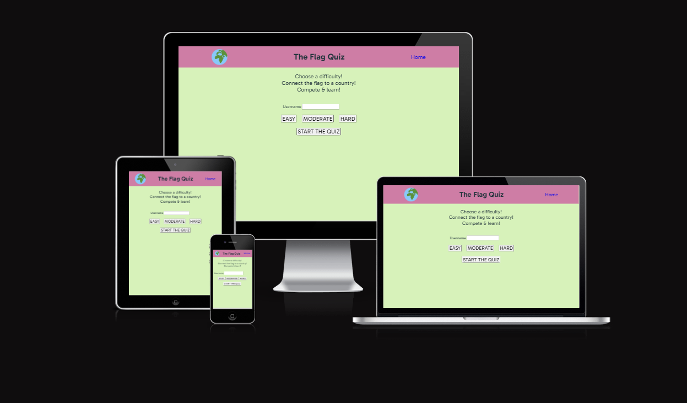
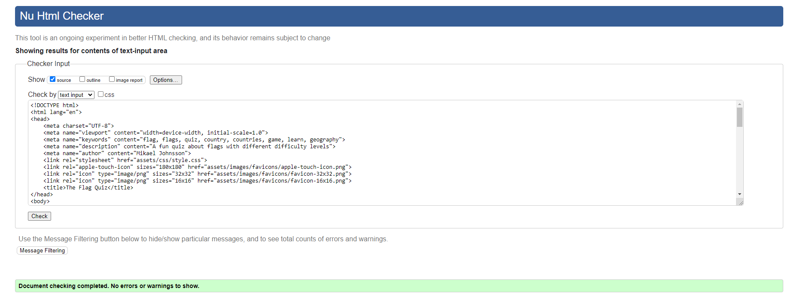
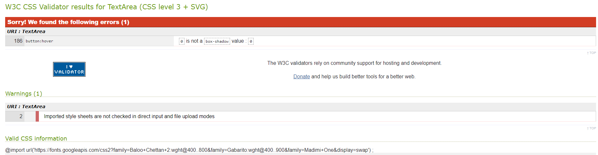
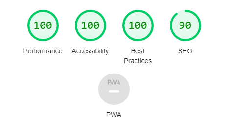
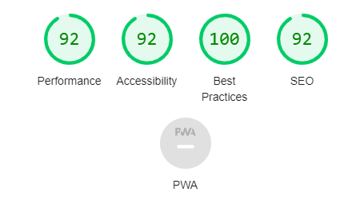
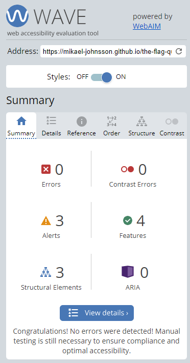
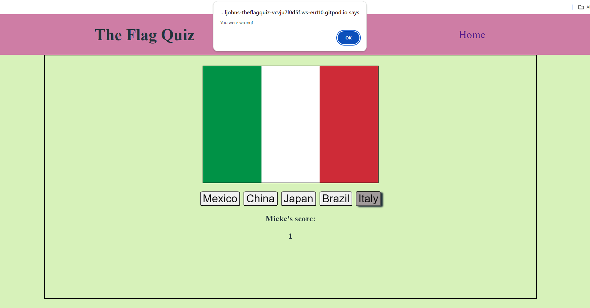
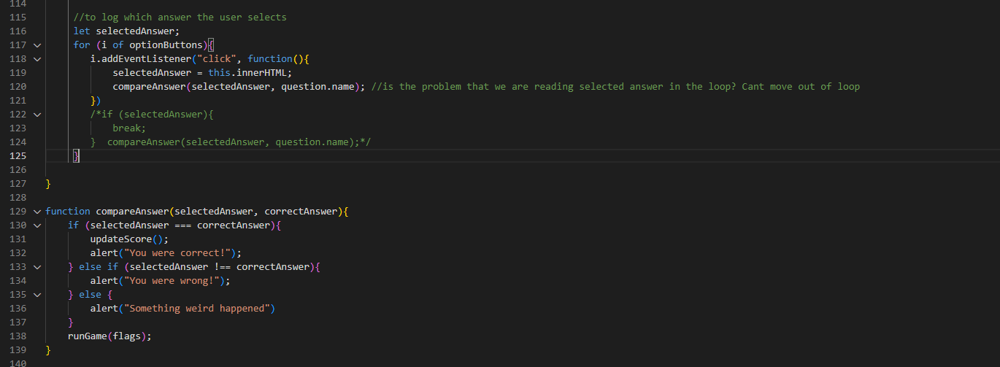
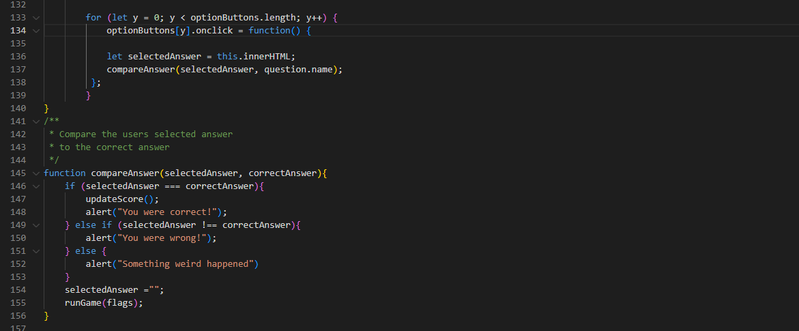
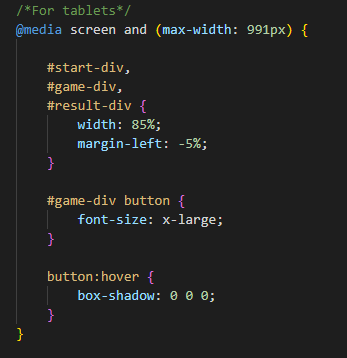

# THE FLAG QUIZ - TESTING

This is the documented testing of the site *The Flag Quiz*.

Find the deployed site [here](https://mikael-johnsson.github.io/the-flag-quiz/)

---

## CONTENTS

* [AUTOMATED TESTING](#automated-testing)
  * [W3C Validator](#w3c-validator)
    * [HTML](#html)
    * [CSS](#css)
  * [Javascript](#javascript)
  * [Lighthouse](#lighthouse)
    * [Desktop](#desktop)
    * [Mobile](#mobile)
  * [WAVE](#wave)

* [MANUAL TESTING](#manual-testing)
  * [Full Testing](#full-testing)

* [BUGS](#bugs)
  * [Solved bugs](#solved-bugs)
  * [Unsolved Bugs](#unsolved-bugs)

---

## AUTOMATED TESTING

### W3C Validator

#### HTML
The HTML code was validated through the W3C validator via direct input. It came out with no errors.

#### CSS
The CSS code was validated through the W3C validator via direct input. It came out with one error. It warned that it did not validate external stylesheets, in this case the imported Google Fonts.

### Javascript
The Javascript code has been validated through JSHint.

The validation returned:
- 12 functions
- The largest signature take 2 arguments, median is 0
- The largest function has 12 statements, median is 5
- The most complex function has a cyclomatic complexity value of 7, median is 2

It also returned 2 warnings:

Line 94 *Functions declared within loops referencing an outer scoped variable may lead to confusing semantics. (flags, difficulty, username, displayUsername, shuffleF, runGame)*

Line 156 *Functions declared within loops referencing an outer scoped variable may lead to confusing semantics. (compareAnswer, question)*
### Lighthouse
The site is also validated through Lighthouse. The validator tests: Performance, Accessibiltiy, Best Practices and SEO.
#### Desktop
On desktop version the site scored 100, 100, 100 and 92.

#### Mobile
On mobile version the site scored 92, 92, 100, 92.

### WAVE
For additional accessibility testing, WAVE has been used to test the site. It rendered three "alerts" indicating that a few paragraph elements could be changed into headings.

## MANUAL TESTING

### Full Testing
Full testing was performed on a PC with 1920x1080 screen and an iPhone XR.

The site was tested on following browsers:
- Google Chrome
- Safari (iPhone only)
- Mozilla Firefox
- Edge

|Feature|Expected outcome|Testing performed|Result|
|---|---|---|---|
|*Header*||||
|Home-link|Redirect to landing page|Click|Works|
|*Landing page*||||
|Username input|Being able to input a username|Input username|Works|
|Empty username input|Error message to appear|Clicking *Start the quiz* without username submitted|Works|
|Hover over buttons (desktop only)|Buttons give visual cue when hovering with mouse|Hover with mouse|Works|
|Choosing difficulty easy|Button stay pressed, easy flags in the game|Click|Works|
|Choosing difficulty moderate|Button stay pressed, moderate flags in the game|Click|Works|
|Choosing difficulty hard|Button stay pressed, hard flags in the game|Click|Works|
|Not choosing difficulty|Error message to appear|Click *Start the quiz* without choosing difficulty|Works|
|Start quiz|Game page to appear with flags and options|Click|Works|
|*Game page*||||
|Flag|A flag appears||Works|
|Options|Options appears||Works|
|Hover over buttons (desktop only)|Buttons give visual cue when hovering with mouse|Hover with mouse|Works|
|Score text|Username is displayed followed by "'s score"||Works|
|Score counter|Increment with 1 every time answer is correct|Give correct answer|Works|
|Answer message|Shows green when answer correct|Give correct answer|Works|
|Answer message|Shows red when answer wrong|Give wrong answer|Works|
|Answer message|Displays the correct answer when answer wrong|Give wrong answer|Works|
|Answer message|Disappears after 1.8 seconds|Answer a question and wait|Works|
|New question|New question to appear after submitting answer|Submit answer|Works|
|*Result page*||||
|Game over|Game ends after 10 questions|Play the entire game|Works|
|End message|Displays different message depending on final score|Get final score 10, <10, <5|Works|
|End message|Displays chosen difficulty|Play the game until finish|Works|
|End message|Displays the username|Play the game until finish|Works|
|End message|Displays final score|Play the game until finish|Works|
|Try again-button|Redirects to landing page|Click|Works|
|Hover over button (desktop only)|Button give visual cue when hovering with mouse|Hover with mouse|Works|

## BUGS
The site has encountered a few bugs, displayed in a list below:
- compareAnswer function not working
- Clicking on buttons on tablet/mobile gave remaining hover function
- No answer message displaying at last question

### Solved Bugs
The compareAnswer function (paired with the way to create it's arguments) were supposed to compare the users selected answer to the correct answer. It did not work.

After enough testing, a different code solution was found on Stack Overflow, created by the user *dfsq*.

---
The hover pseudo class makes all the buttons on the site give a visual cue when hovering them with the mouse. When using a tablet or mobile that function instead gave the cue after the button had been clicked, and stayed there. This created the problem that one option button at the next question still had the que.

The function was removed in the media queries for tablets and mobile.

### Unsolved bugs

Unfortunately the code, at the moment, does not allow the answer message to display after the final question, as the end message appears instead. The user can still see if the answer was correct by looking at the score before and after answering the question.